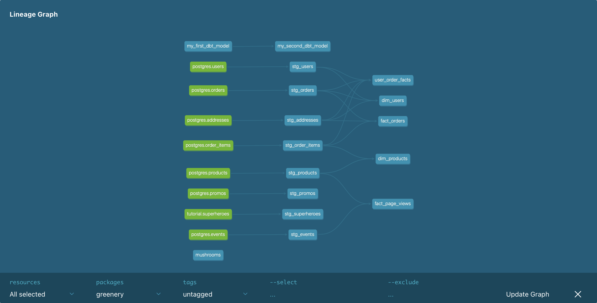

# Week 2 Questions

## Part 1

We were approached by the marketing team to answer some questions about Greenery’s users! Use your staging models you created in Week 1 to answer their questions:

1. What is our user repeat rate?
Repeat Rate = Users who purchased 2 or more times / users who purchased

```
with user_order_counts as (
select u.user_id, 
  count(o.order_id), 
  case when count(o.order_id) > 0 then 1 else 0 end as buyer,
  case when count(o.order_id) > 1 then 1 else 0 end as repeat_buyer
from dbt_jenna_j.stg_users u
left join dbt_jenna_j.stg_orders o on u.user_id = o.user_id
group by u.user_id)

select 
  round(sum(repeat_buyer)::decimal / sum(buyer)::decimal, 4) as rate
from user_order_counts;
```
0.7984

2. What are good indicators of a user who will likely purchase again? What about indicators of users who are likely NOT to purchase again? If you had more data, what features would you want to look into to answer this question?

Indicators of a user likely to purchase again:

- saved payment info to account
- purchased multiple products in their first order
- purchased products that will be "used up"
- left a positive review

Indicators of a users likely to not purchase again:

- left a negative review
- did not save payment information or did not create an account

Features to investigate

- product attributes
- account attributes
- how site was discovered by user
- satisfaction with purchase

3. Explain the marts models you added. Why did you organize the models in the way you did?

I added the suggested models: fact_orders, dim_products, dim_users, user_order_facts, and fact_page_views. I also added an intermediate model, as I noticed I used the same CTE for both the user_order_facts and fact_orders models, which aggregated the order_items table to the order level.

4. Use the dbt docs to visualize your model DAGs to ensure the model layers make sense



## Part 2

1. What assumptions are you making about each model? (i.e. why are you adding each test?)

I'm approaching tests from the perspective of these are assumptions I would normally put in the table creation statement - primary keys, foreign keys, null/not null, and check constraints. But rather than having the insert fail, I am using tests to make sure these assumptions are true after the values have been inserted/materialized. I also used the custom test positive_values for amounts.

2. Did you find any “bad” data as you added and ran tests on your models? How did you go about either cleaning the data in the dbt model or adjusting your assumptions/tests?

All of my tests succeeded. However, this is likely because I only tested basic things and I don't know the data very well beyond what I can see of it - therefore I don't have the domain knowledge to have extensive assumptions to check in the first place.

3. Your stakeholders at Greenery want to understand the state of the data each day. Explain how you would ensure these tests are passing regularly and how you would alert stakeholders about bad data getting through.

I would probably run the tests every day after running the models, and then investigate any failed tests. In order to alert stakeholders, I would need to know who the data owners are - which would require some documentation to accompany the source database. I expect there is a way to schedule runs/tests automatically, but I'm not familiar with that yet.