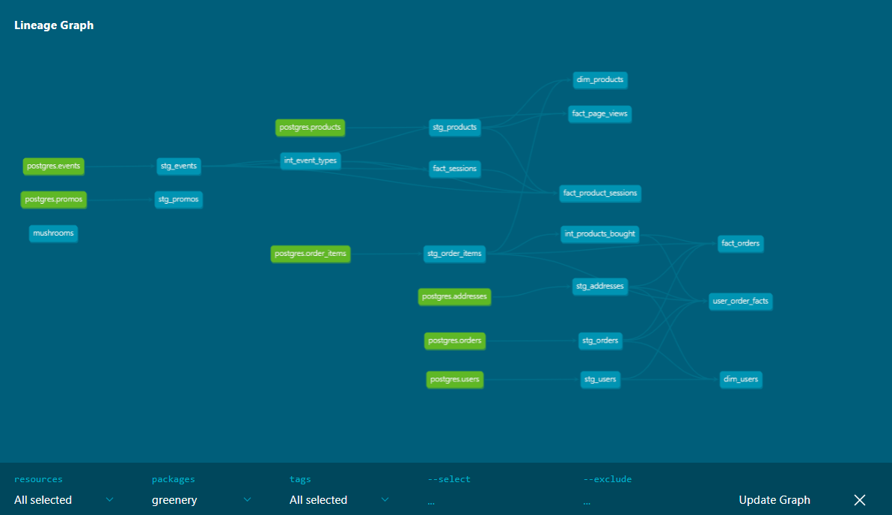

# Week 3 Questions

## Part 1

NOTE: conversion rate is defined as the # of unique sessions with a purchase event / total number of unique sessions. Conversion rate by product is defined as the # of unique sessions with a purchase event of that product / total number of unique sessions that viewed that product

1. What is our overall conversion rate?

62%

```
select 
  count(*) as total_sessions,
  (select 
    count(*)
    from dbt_jenna_j.fact_sessions
    where checkout_count > 0) as sessions_with_checkout
from dbt_jenna_j.fact_sessions;
```
`361 / 578 = ~0.62`

2. What is our conversion rate by product?

```
select 
  product_guid, 
  product_name,
  count(*) as total_sessions, 
  sum(checkout_count) as purchase_sessions,
  round(sum(checkout_count) / count(*), 2) as conversion_rate
from dbt_jenna_j.fact_product_sessions
group by product_guid, product_name
order by conversion_rate desc;
```
Excerpt of results:

- String of pearls: .89
- Fiddle Leaf Fig: .89
- Monstera: .88
- ZZ Plant: .87
- Cactus: .85

## Part 2

1. Create a macro to simplify part of a model(s). Think about what would improve the usability or modularity of your code by applying a macro. Large case statements, or blocks of SQL that are often repeated make great candidates. Document the macro(s) using a .yml file in the macros directory.

macro: one_hot_encode

## Part 3

Done

## Part 4

used dbt-utils

## Part 5

